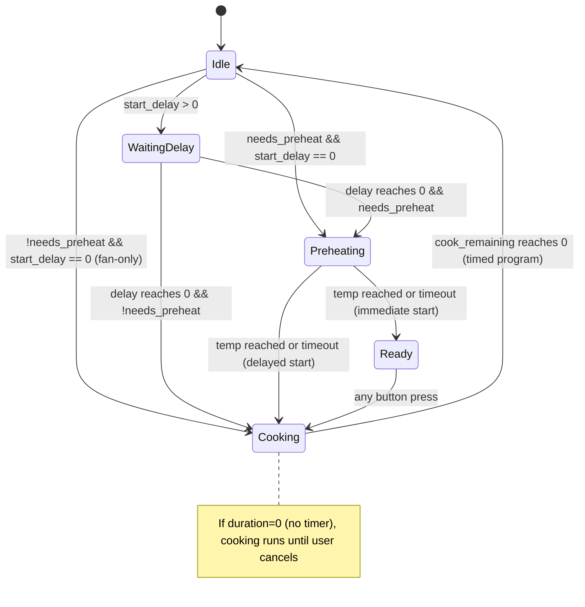

# ESPHome Configuration for Libre Oven (ESP32-S3)

This folder contains the ESPHome configuration for the Libre Oven Controller using an **ESP32-S3-DevKitC-1** with an **ESP32-S3-WROOM-1-N16R8** module (16 MB Flash, 8 MB PSRAM).

The firmware implements:

- A **multi-page UI** on a 2.4" ILI9341 TFT.
- 3x rotary encoders with push buttons (Timer, Temperature, Mode).
- **PID temperature control** with slow PWM output for SSR-driven heating.
- Full **timer + preheat + ready + cook** state machine with resume-after-power-loss.
- **Cooling fan safety**: internal cooling fan stays on until oven temperature drops below a configurable threshold (default 50 °C).
- Safety gating so **heating only runs when timer, temperature and elements are correctly set**.
- **Fan-only mode**: fan can run without a temperature target or heating elements.
- Visual oven mimic, element status, Wi-Fi and light indicators.
- Optional **LED indicators** for elements and **buzzer** alerts.
- **Home Assistant integration** via ESPHome API with PID tuning sensors and autotune button.

---

> **Hardware details** (GPIO pinout, wiring, PT100 setup, buzzer circuit, 3D parts, PCB) are in the [project build guide](../README.md).

---

## Temperature Sensor Filters

The raw PT100 readings pass through two filters before reaching the PID controller and display:

1. **Lambda filter**: Rejects NaN values and readings outside the 1-350 °C range. Invalid readings are discarded (not clamped to 0).
2. **Median filter**: Window size 5, publishes every reading. Smooths out occasional noise spikes from electrical interference.

---

## PID Temperature Control

Temperature regulation uses ESPHome's **PID climate** component instead of simple hysteresis, providing smoother and more accurate control.

### Architecture

```
PID Climate ──> Slow PWM Output ──> SSR Relays (Top/Bottom/Grill)
     ↑                                    │
     │                                    ↓
PT100 Sensor ◄──────────── Oven Temperature
```

- **PID climate** (`pid_climate`): Calculates 0-100% heat output based on current vs target temperature.
- **Slow PWM** (`pid_heat_output`): Converts the continuous PID output to time-proportioned ON/OFF cycles for the SSRs. Period: **10 s** (e.g., 60% output = 6 s ON, 4 s OFF).
- The state machine controls **when** heating is allowed; the PID controls **how much** power is applied.

### PID Parameters

Current tuned values (via autotune with "Some Overshoot PID" rule):

- Kp: `0.03614`
- Ki: `0.00018`
- Kd: `2.80257`
- Output averaging samples: `5`
- Derivative averaging samples: `5`

### PID Autotune

A **PID Autotune** button is exposed to Home Assistant. To run autotune:

1. Set a program with heating elements and a target temperature (e.g., 200 °C).
2. Apply the program so the oven is heating.
3. Press the "PID Autotune" button in Home Assistant (found under Developer Tools > Actions > Button press, or in the device page).
4. The autotune will deliberately oscillate the temperature above and below the setpoint. This can take 30-60+ minutes depending on the oven.
5. When complete, the optimal Kp/Ki/Kd values are printed to the device logs and can also be read from the PID sensor entities in Home Assistant.
6. Update the `control_parameters` in the YAML with the new values.

Autotune parameters:
- `positive_output: 0.7` (70% maximum heat output during autotune)
- `noiseband: 0.05` (tight noise band for accurate oscillation detection)

### PID Sensor Entities

The following sensors are exposed to Home Assistant for monitoring PID behavior:

- PID Heat Output (0-100%)
- PID Proportional term
- PID Integral term
- PID Derivative term
- PID Error (target - actual)
- PID Kp, Ki, Kd (current parameters)

---

## UI & Encoder Behaviour

The UI uses multiple pages controlled by the encoder buttons:

- **Page 0 -- Main Screen**
  - Left column:
    - State label with color: Idle (white), Waiting (yellow), Preheating (red), Ready (green), Cooking (green).
    - Timer display: countdown (`HH:MM:SS`), `PREHEATING` during preheat, `OVEN READY` / `Press to start` during ready state, `NO TIMER` when duration=0.
    - Below: total programmed cook time.
    - Current and target temperature labels.
  - Right side: oven graphic with elements, fan, light, and Wi-Fi indicator.
  - Bottom labels: `TIME` (left), `MODE` (center), `TEMPERATURE` (right) to show knob roles.

- **Page 1 -- Timer Screen**
  - `DURATION` (top):
    - Shows `NO TIMER` when `working_timer == 0`.
    - Otherwise HH:MM value.
  - `WHEN TO START` (bottom):
    - Shows `NOW` when `working_start_delay == 0`.
    - Otherwise HH:MM delay.
  - First press on timer button: edit `DURATION`.
  - Second press: switch to editing `WHEN TO START`.
  - Third press: confirm and return to main.

- **Page 2 -- Temperature Screen**
  - Big `SET TEMPERATURE` title.
  - Large `°C` value and horizontal bar from 0-280 °C.
  - Fine/coarse/coarser adjustments from the three knobs.

- **Page 3 -- Mode Screen**
  - List: `Top Element`, `Bottom Element`, `Grill`, `Fan`, `Back`.
  - Mode knob moves the arrow; press toggles the **desired** element flags.

- **Page 4 -- Apply Confirmation**
  - Confirms starting/updating a program.

- **Page 5 -- Cancel Confirmation**
  - Confirms canceling the current program.

### Encoder Step Patterns

On each page, the three encoders behave as:

- **Temperature page**:
  - Temp knob: ±1 °C.
  - Timer knob: ±10 °C.
  - Mode knob: ±5 °C.

- **Timer page**:
  - Temp knob: ±30 min (duration or start delay).
  - Mode knob: ±10 min.
  - Timer knob: ±1 min.

- **Mode page**:
  - Mode knob: navigate items.
  - Buttons toggle `desired_*` flags.

---

## Timer & Heating State Machine

Heating is **safety-gated** so elements only energize when:

- A **target temperature** is set (`active_temperature > 0`),
- At least one **heating element** (top/bottom/grill) is selected, and
- A program is in **preheat, ready, or cook** phase (`timer_state` 2, 3, or 4).

The **fan** can run independently without temperature or heating elements, only requiring an active program (`timer_state` 2, 3, or 4).

### High-level timer states



### Timer state values

| Code | Name       | Description |
|------|------------|-------------|
| 0    | Idle       | No program running |
| 1    | Waiting    | Delay countdown before cook |
| 2    | Preheating | Heating to target temperature |
| 3    | Ready      | At temperature, waiting for user to press any button |
| 4    | Cooking    | Active cooking, timer counting down |

### "Ready" state behavior

After preheating completes, the oven enters a **ready** state that:

- Keeps the PID heating at the target temperature.
- Keeps the fan running if selected.
- Keeps the cooling fan (light relay) on.
- Displays **"OVEN READY"** and **"Press to start"** on the screen.
- Keeps the screen always on (no sleep timeout).
- Waits for **any button press** (temperature, timer, or mode) to transition to cooking.
- **Auto-skip**: If the program was started with a delay (`working_start_delay > 0`), the ready state is skipped and cooking starts immediately (the user may not be present).

### Fan-only mode

If a program is started with only the fan selected (no heating elements or temperature = 0), the preheating phase is skipped entirely and the program goes directly to cooking. This allows using the oven fan for cooling or air circulation without heating.

### Preheating timeout

A configurable timeout (`preheat_timeout_minutes`, default **20 minutes**) prevents the oven from being stuck in preheating indefinitely. When the timeout expires, the system transitions to ready/cooking regardless of whether the target temperature was reached. Set to 0 to disable.

### Implementation variables

- `timer_state`:
  - `0` -- Idle
  - `1` -- Waiting (delay before cook)
  - `2` -- Preheating
  - `3` -- Ready (at temperature, waiting for user)
  - `4` -- Cooking
- `working_timer` -- user-editable duration (minutes). 0 = no timer, run until cancel.
- `working_start_delay` -- user-editable start delay (minutes).
- `timer_delay_remaining` -- delay countdown (seconds, not restored).
- `timer_cook_remaining` -- cook countdown (seconds, **restored** across reboots). 0 = no timer.
- `cook_total_seconds` -- frozen total cook time for display (seconds, restored).
- `desired_top_element`, `desired_bottom_element`, `desired_grill_element`, `desired_fan_element` -- logical element selection from Mode page.

### Heating gate

On the main page, each 1 s tick:

- Runs the timer state machine (temperature from MAX31865 PT100).
- Computes:

```cpp
bool any_heating_active =
  id(active_top_element) ||
  id(active_bottom_element) ||
  id(active_grill_element);

bool allow_heat =
  (target > 0.0f && any_heating_active) &&
  (id(timer_state) == 2 || id(timer_state) == 3 || id(timer_state) == 4);
```

- If `allow_heat`: PID climate is set to HEAT mode with the target temperature. The slow PWM output drives the SSRs.
- If `!allow_heat`: PID climate is set to OFF, all heating relays are forced off.
- Fan control is independent: `allow_fan = active_fan_element && program_active` (states 2, 3, or 4).

### Cooling fan safety

The light relay (which also controls the internal cooling fan) stays on whenever:

- Heating is active (`allow_heat`), OR
- The oven fan is running (`allow_fan`), OR
- The oven temperature is above the **cooldown threshold** (default 50 °C, configurable via `cooldown_temp_threshold`).

This ensures the internal cooling fan keeps running after a program ends until the oven is at a safe temperature, preventing heat damage to components.

### Resume after power loss

- `timer_cook_remaining` and `cook_total_seconds` are stored (`restore_value: yes`), so:
  - If there is remaining cook time at boot and `timer_state == 0`, the firmware resumes:
    - State 1 if still in delay,
    - Or state 4 (cooking) directly.
- Once delay finishes, `working_start_delay` is cleared so the delay is **one-shot** and will not re-run after a power cycle.

---

## Buzzer Behaviour

- **End of preheat / ready notification**:
  - Script `buzzer_preheat_finished` runs:
    - 2 fast beeps on `buzzer_output` (GPIO6).
- **End of cook**:
  - Script `buzzer_cook_finished` runs:
    - 3 slower beeps.
- Buzzer is only an indicator; main safety remains with SSRs and the oven's thermal cutouts.

---

## Logging Configuration

The logger is configured to minimize noise while keeping PID autotune output visible:

- Global level: `DEBUG`
- Most components (sensor, display, wifi, api, etc.): `ERROR`
- PID components (`pid`, `pid.autotune`, `pid.climate`): `DEBUG`
- MAX31865: `NONE` (errors handled by sensor filters)
- Generic component messages: `NONE`

The logger uses `deassert_rts_dtr: true` to prevent DTR/RTS signals from holding the ESP32-S3 in download mode when a serial monitor connects.

---

## Home Assistant Entities

The following entities are exposed to Home Assistant:

### Sensors
- Oven Temperature (current reading from PT100)
- Active Temperature (target when program is running)
- Timer State (text: IDLE/WAITING/PREHEATING/READY/COOKING)
- Timer State Code (numeric: 0-4)
- Active Countdown Seconds
- Active Countdown Formatted (HH:MM:SS)
- Top/Bottom/Grill Element State (0=off, 1=selected, 2=armed, 3=heating)
- Fan Element State (0=off, 1=selected, 2=active)
- Oven Frame State (0=off, 1=selected, 2=active)
- System ON (binary: any SSR active or program running)
- PID Heat Output, Proportional, Integral, Derivative, Error, Kp, Ki, Kd

### Controls
- Set Temperature (number, 0-280 °C)
- Cook Duration (number, minutes)
- Start Delay (number, minutes)
- Top/Bottom/Grill/Fan Element Selected (switches)
- Apply Program (button)
- Cancel Program (button)
- PID Autotune (button)
- Restart ESP32-S3 (button)

---

## Build & Flash

Build and flash through the **ESPHome Dashboard** (Home Assistant add-on or standalone):

1. Create a `secrets.yaml` in this folder with your Wi-Fi and API credentials.
2. Import `libre_oven_s3.yaml` into the ESPHome Dashboard.
3. Install to the device via USB (first flash) or OTA (subsequent updates).

For the full hardware build guide, GPIO pinout, and wiring instructions, see the [project README](../README.md).

---

## Safety

See the [project build guide](../README.md#safety) for important safety information regarding high voltage and high temperatures.
